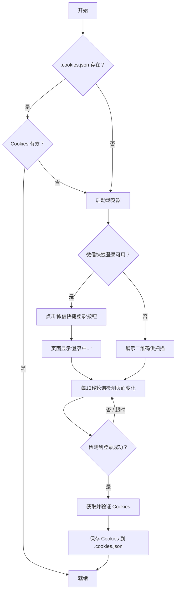

# 腾讯文档 Markdown 工具

> 一个用于操作腾讯文档 Markdown 的 Python 工具，支持新建、写入、下载、读取、更新、重命名、删除等操作。

[](https://opensource.org/licenses/MIT)
[](https://www.python.org/)

---

## 功能特性

- ✅ **新建文档** — 创建空白 Markdown 文档或新建并直接写入内容
- ✅ **读取文档** — 获取文档的 Markdown 原始内容
- ✅ **更新文档** — 覆盖已有文档内容（支持文本或 `.md` 文件）
- ✅ **下载文档** — 将文档保存为本地 `.md` 文件
- ✅ **删除文档** — 将文档移入回收站
- ✅ **重命名文档** — 修改文档标题
- ✅ **查看文档信息** — 获取文档元数据
- ✅ **自动登录** — 支持微信/QQ 扫码登录，Cookie 自动缓存复用

---

## 快速开始

### 环境要求

- Python >= 3.10

### 安装

```bash
# 1. 安装 Python 依赖
pip install -r requirements.txt

# 2. 安装 Playwright 浏览器
playwright install chromium
```

### 登录

首次使用需要扫码登录腾讯文档：

```bash
python -m src.main login
```

登录成功后，Cookie 会自动保存到 `.cookies.json`，后续操作无需重复登录。

### 基本使用

```bash
# 新建文档并写入内容
python -m src.main write "我的文档" "# Hello World"

# 读取文档
python -m src.main read https://docs.qq.com/markdown/DQxxxxxxxx

# 下载文档到本地
python -m src.main download https://docs.qq.com/markdown/DQxxxxxxxx
```

---

## 功能操作

### 1. 新建并写入文档

新建一个腾讯文档 Markdown，写入内容后返回文档链接。

**命令行：**
```bash
python -m src.main write "我的文档" "# Hello World\n这是我的文档内容。"
```

**编程接口：**
```python
from src.main import handle_create_and_write

result = handle_create_and_write('我的文档', '# Hello World\n这是内容。')
# result: {'docUrl': ..., 'padId': ..., 'globalPadId': ..., 'title': ...}
# → 将 result['docUrl'] 分享给用户
```

### 2. 新建空文档

```bash
python -m src.main create "我的新文档"
```

```python
from src.main import handle_create

result = handle_create('我的文档')
# result: {'docUrl': ..., 'padId': ..., 'globalPadId': ..., 'title': ...}
```

### 3. 下载文档

将腾讯文档 Markdown 下载为本地 `.md` 文件。

> **注意：** 系统会自动从文档页面解析真实的 `padId`（URL 中的标识符与 API 所需的真实 padId 不同）。

```bash
python -m src.main download https://docs.qq.com/markdown/DQxxxxxxxx
python -m src.main download https://docs.qq.com/markdown/DQxxxxxxxx -o ./output.md
```

```python
from src.main import handle_download

result = handle_download('https://docs.qq.com/markdown/DQxxxxxxxx', './output.md')
# result: {'path': ..., 'content': ...}
```

### 4. 读取文档

```bash
python -m src.main read https://docs.qq.com/markdown/DQxxxxxxxx
```

```python
from src.main import handle_read

content = handle_read('https://docs.qq.com/markdown/DQxxxxxxxx')
```

### 5. 更新文档

覆盖已有文档的内容（支持直接传入文本或 `.md` 文件路径）。

```bash
python -m src.main update https://docs.qq.com/markdown/DQxxxxxxxx "# 新内容"
python -m src.main update https://docs.qq.com/markdown/DQxxxxxxxx ./updated.md
```

```python
from src.main import handle_update

handle_update('https://docs.qq.com/markdown/DQxxxxxxxx', '# 更新后的内容')
```

### 6. 删除文档

将文档移入回收站（可恢复）。

```bash
python -m src.main delete https://docs.qq.com/markdown/DQxxxxxxxx
```

```python
from src.main import handle_delete

result = handle_delete('https://docs.qq.com/markdown/DQxxxxxxxx')
# result: {'padId': ..., 'deleted': True}
```

### 7. 重命名文档

```bash
python -m src.main rename https://docs.qq.com/markdown/DQxxxxxxxx "新标题"
```

```python
from src.main import handle_rename

handle_rename('https://docs.qq.com/markdown/DQxxxxxxxx', '新标题')
```

### 8. 获取文档信息

```bash
python -m src.main info https://docs.qq.com/markdown/DQxxxxxxxx
```

```python
from src.main import handle_info

info = handle_info('https://docs.qq.com/markdown/DQxxxxxxxx')
```

### 9. 登录管理

```bash
python -m src.main login          # 使用缓存的 Cookies（如有效）
python -m src.main login --force  # 强制重新登录
```

---

## 认证机制

首次使用需扫码登录，之后 Cookie 会缓存在 `.cookies.json` 中自动复用。

支持两种登录方式：

1. **扫码登录** — 使用微信/QQ 扫描二维码
2. **微信快捷登录** — 如果之前在当前浏览器已有微信登录记录，系统会自动检测并点击"微信快捷登录"按钮，页面显示"登录中..."后自动完成登录



---

## 项目结构

```
tencent-docs-markdown/
├── requirements.txt           # Python 依赖
├── README.md                  # 项目说明文档（本文件）
├── SKILL.md                   # Agent 技能定义文件
├── publish.sh                 # 版本发布脚本
├── .cookies.json              # 保存的登录 Cookies（自动生成，已加入 .gitignore）
└── src/
    ├── __init__.py            # Python 包初始化
    ├── main.py                # 主入口 & CLI 命令
    ├── auth.py                # 扫码登录 & Cookie 管理
    ├── api.py                 # 腾讯文档 Markdown API 客户端
    └── login_with_polling.py  # 轮询登录脚本
```

---

## 核心概念

### URL 标识符与真实 padId

腾讯文档 Markdown 的 URL 格式为 `https://docs.qq.com/markdown/DSxxxxxxxx`，其中 `DSxxxxxxxx` 是 **URL 标识符**，并非 API 所需的真实 `padId`。

系统通过 `resolve_real_pad_id()` 函数访问文档页面，从嵌入的 `basicClientVars` JSON 中提取真实的 `padId`，然后拼接为 `globalPadId`（格式：`{domainId}${padId}`）用于 API 调用。

此机制对 **下载（download）**、**读取（read）**、**更新（update）** 操作自动生效，用户无需关注。

---

## API 参考

| 接口 | 方法 | 路径 | 关键参数 |
|------|------|------|----------|
| 创建文档 | GET | `/cgi-bin/online_docs/createdoc_new` | `doc_type=14`, `create_type=1`, `folder_id=/`, `title`, `xsrf` |
| 删除文档 | POST | `/cgi-bin/online_docs/doc_delete` | `pad_id`, `domain_id`, `xsrf` |
| 读取内容 | POST | `/api/markdown/read/data` | `file_id`（globalPadId） |
| 写入内容 | POST | `/api/markdown/write/data` | `file_id`, `mark_down` |
| 文档信息 | POST | `/cgi-bin/online_docs/doc_info` | `file_id` |
| 重命名 | POST | `/cgi-bin/online_docs/doc_changetitle` | `pad_id`, `title`, `xsrf` |
| 解析真实 padId | GET | 文档页面 HTML | 从 `basicClientVars` 中提取 `padId` |

---

## 错误处理

| 错误 | 原因 | 解决方案 |
|------|------|----------|
| Cookie 过期 | 会话超时 | 自动通过扫码重新登录 |
| `retcode !== 0` | API 返回错误 | 显示详细错误信息 |
| 无效 URL | 腾讯文档 URL 格式不正确 | 确保格式为：`https://docs.qq.com/markdown/xxxxx` |
| 资源不存在 | URL 标识符无法解析为真实 padId | 检查文档是否存在或是否有访问权限 |

---

## 注意事项

- **Python 版本要求：** Python >= 3.10
- Markdown 文档类型编号为 `14`（`doc_type=14`）
- 默认 `domain_id` 为 `300000000`
- XSRF Token 从 `TOK` Cookie 中提取
- Cookies 存储在 `.cookies.json` 中（已加入 `.gitignore`）
- **安全提示：** `.cookies.json` 包含敏感的会话 Cookie，请勿提交到版本控制或分享给他人，建议限制其文件权限（如 `chmod 600 .cookies.json`）
- 删除操作会将文档移至回收站（可恢复）
- 下载/读取/更新操作会自动解析 URL 中的标识符为真实 padId
- 建议在受控或受信环境中运行此工具，因为 Playwright 会下载 Chromium 并使用浏览器自动化权限

---

## 许可证

[MIT](LICENSE)
