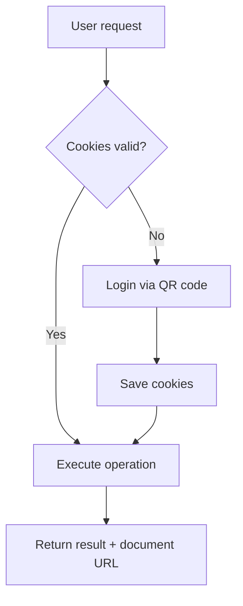
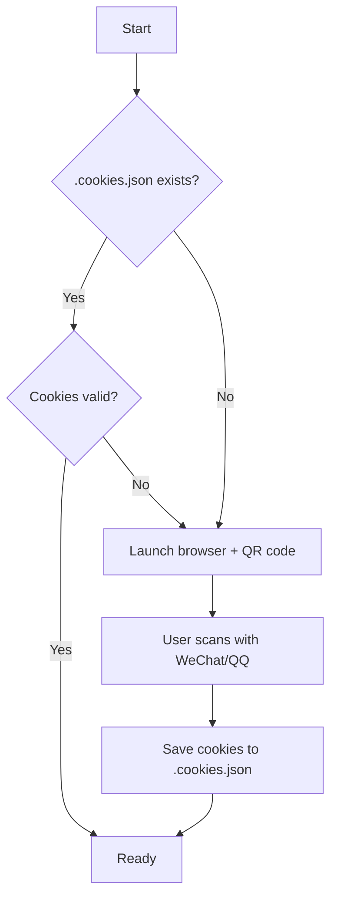

# Tencent Docs Markdown Skill

> **Name:** `tencent-docs-markdown`
> **License:** MIT
> **Description:** 腾讯文档 Markdown 技能，支持新建文档并写入内容、下载、删除、读取、更新、重命名等操作。

---

## How the Agent Uses This Skill

### Trigger Phrases

当用户表达以下意图时，Agent 应激活此技能：

| Intent | Example Phrases |
|---|---|
| **Create & Write** | "新建一个Markdown到腾讯文档并写入内容" / "帮我新建腾讯文档md，写入以下内容" / "上传xxx.md到腾讯文档" / "上传xxx.md文档" / "同步xxx.md文档" / "提交xxx.md文档" / "把本地文件同步到腾讯文档" / "Upload my-notes.md to Tencent Docs" / "Create a markdown doc and write content" |
| **Create** (empty) | "帮我创建名为xxx.md" / "新建一个Markdown文档" / "Create a new markdown called xxx" |
| **Download** | "下载腾讯文档到本地" / "Download https://docs.qq.com/markdown/xxx" / "把这个文档保存到本地" |
| **Read** | "读取这个文档内容" / "查看Markdown内容" / "Show me the content of this doc" |
| **Update** | "更新腾讯文档内容" / "用本地文件覆盖腾讯文档" / "Write new content to this doc" |
| **Delete** | "删除这个腾讯文档" / "Delete https://docs.qq.com/markdown/xxx" / "帮我删掉这个Markdown" |
| **Rename** | "重命名这个文档为xxx" / "Rename this document to xxx" |
| **Info** | "查看文档信息" / "获取这个文档的详情" |
| **Login** | "登录腾讯文档" / "重新登录" / "Cookie过期了" |

### Agent Workflow



---

## Quick Start

```bash
# 1. Install dependencies
npm install

# 2. Login (scan QR code with WeChat/QQ)
node src/index.js login

# 3. Create a document and write content
node src/index.js write "My Document" "# Hello World"
```

---

## Operations

### 1. Create & Write Document

Create a new Tencent Docs Markdown and write content, then return the document URL.

**CLI:**
```bash
node src/index.js write "My Document" "# Hello World\nThis is my document."
```

**Agent API:**
```javascript
const { handleCreateAndWrite } = require('./src/index');
const result = await handleCreateAndWrite('My Document', '# Hello World\nThis is the content.');
// result: { docUrl, padId, globalPadId, title }
// → Share result.docUrl with the user
```

### 2. Create Empty Document

Create a new empty Markdown document.

**CLI:**
```bash
node src/index.js create "My New Document"
```

**Agent API:**
```javascript
const { handleCreate } = require('./src/index');
const result = await handleCreate('My Document');
// result: { docUrl, padId, globalPadId, title }
```

### 3. Download Document

Download a Tencent Docs Markdown to a local `.md` file.

**CLI:**
```bash
node src/index.js download https://docs.qq.com/markdown/DQxxxxxxxx
node src/index.js download https://docs.qq.com/markdown/DQxxxxxxxx -o ./output.md
```

**Agent API:**
```javascript
const { handleDownload } = require('./src/index');
const result = await handleDownload('https://docs.qq.com/markdown/DQxxxxxxxx', './output.md');
// result: { path, content }
```

### 4. Read Document

Read and return the content of a document.

**CLI:**
```bash
node src/index.js read https://docs.qq.com/markdown/DQxxxxxxxx
```

**Agent API:**
```javascript
const { handleRead } = require('./src/index');
const content = await handleRead('https://docs.qq.com/markdown/DQxxxxxxxx');
```

### 5. Update Document

Overwrite an existing document's content.

**CLI:**
```bash
node src/index.js update https://docs.qq.com/markdown/DQxxxxxxxx "# New Content"
node src/index.js update https://docs.qq.com/markdown/DQxxxxxxxx ./updated.md
```

**Agent API:**
```javascript
const { handleUpdate } = require('./src/index');
await handleUpdate('https://docs.qq.com/markdown/DQxxxxxxxx', '# Updated content');
```

### 6. Delete Document

Move a document to trash.

**CLI:**
```bash
node src/index.js delete https://docs.qq.com/markdown/DQxxxxxxxx
```

**Agent API:**
```javascript
const { handleDelete } = require('./src/index');
const result = await handleDelete('https://docs.qq.com/markdown/DQxxxxxxxx');
// result: { padId, deleted: true }
```

### 7. Rename Document

**CLI:**
```bash
node src/index.js rename https://docs.qq.com/markdown/DQxxxxxxxx "New Title"
```

**Agent API:**
```javascript
const { handleRename } = require('./src/index');
await handleRename('https://docs.qq.com/markdown/DQxxxxxxxx', 'New Title');
```

### 8. Get Document Info

**CLI:**
```bash
node src/index.js info https://docs.qq.com/markdown/DQxxxxxxxx
```

**Agent API:**
```javascript
const { handleInfo } = require('./src/index');
const info = await handleInfo('https://docs.qq.com/markdown/DQxxxxxxxx');
```

### 9. Login

**CLI:**
```bash
node src/index.js login          # Use cached cookies if valid
node src/index.js login --force  # Force re-login
```

---

## Authentication

首次使用需扫码登录，之后 Cookie 会缓存在 `.cookies.json` 中自动复用。



---

## API Reference

| API | Method | Path | Key Params |
|---|---|---|---|
| Create Document | GET | `/cgi-bin/online_docs/createdoc_new` | `doc_type=14`, `create_type=1`, `folder_id=/`, `title`, `xsrf` |
| Delete Document | POST | `/cgi-bin/online_docs/doc_delete` | `pad_id`, `domain_id`, `xsrf` |
| Read Content | POST | `/api/markdown/read/data` | `file_id` (globalPadId) |
| Write Content | POST | `/api/markdown/write/data` | `file_id`, `mark_down` |
| Document Info | POST | `/cgi-bin/online_docs/doc_info` | `file_id` |
| Rename | POST | `/cgi-bin/online_docs/doc_changetitle` | `pad_id`, `title`, `xsrf` |

---

## Project Structure

```
tencent-docs-markdown/
├── package.json          # Dependencies & scripts
├── SKILL.md              # Skill definition (this file)
├── README.md             # User guide
├── .cookies.json         # Saved login cookies (auto-generated, gitignored)
└── src/
    ├── index.js          # Main entry & CLI commands
    ├── auth.js           # QR code login & cookie management
    └── api.js            # Tencent Docs Markdown API client
```

---

## Error Handling

| Error | Cause | Resolution |
|---|---|---|
| Cookie expired | Session timeout | Auto re-login via QR code |
| `retcode !== 0` | API error | Error message displayed with details |
| Invalid URL | Wrong Tencent Docs URL | Ensure format: `https://docs.qq.com/markdown/xxxxx` |

---

## Notes

- Markdown `doc_type` is `14`
- Default `domain_id` is `300000000`
- XSRF token is extracted from the `TOK` cookie
- Cookies are stored in `.cookies.json` (gitignored)
- Delete moves documents to trash (recoverable)
