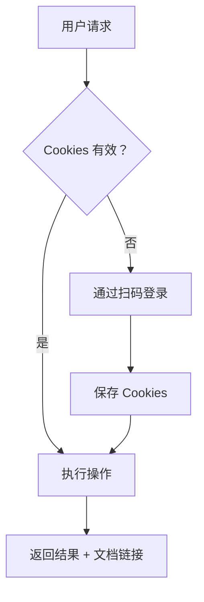
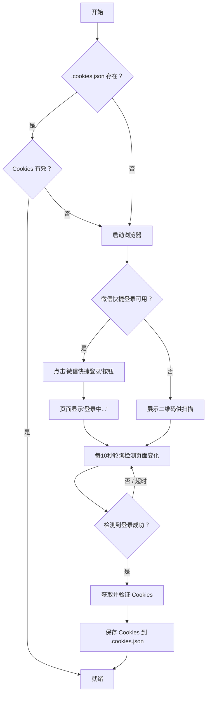

# 腾讯文档 Markdown 技能

> **名称：** `tencent-docs-markdown`
> **许可证：** MIT
> **简介：** 腾讯文档 Markdown 技能，支持新建文档并写入内容、下载、删除、读取、更新、重命名等操作。

---

## Agent 如何使用此技能

### 触发短语

当用户表达以下意图时，Agent 应激活此技能：

| 意图 | 示例短语 |
|------|----------|
| **新建并写入** | "新建一个Markdown到腾讯文档并写入内容" / "帮我新建腾讯文档md，写入以下内容" / "上传xxx.md到腾讯文档" / "上传xxx.md文档" / "同步xxx.md文档" / "提交xxx.md文档" / "把本地文件同步到腾讯文档" |
| **新建空文档** | "帮我创建名为xxx.md" / "新建一个Markdown文档" |
| **下载** | "下载腾讯文档到本地" / "把这个文档保存到本地" |
| **读取** | "读取这个文档内容" / "查看Markdown内容" |
| **更新** | "更新腾讯文档内容" / "用本地文件覆盖腾讯文档" |
| **删除** | "删除这个腾讯文档" / "帮我删掉这个Markdown" |
| **重命名** | "重命名这个文档为xxx" |
| **查看信息** | "查看文档信息" / "获取这个文档的详情" |
| **登录** | "登录腾讯文档" / "重新登录" / "Cookie过期了" |

### Agent 工作流程



---

## 快速开始

```bash
# 1. 安装依赖
npm install

# 2. 登录（使用微信/QQ 扫描二维码）
node src/index.js login

# 3. 新建文档并写入内容
node src/index.js write "我的文档" "# Hello World"
```

---

## 功能操作

### 1. 新建并写入文档

新建一个腾讯文档 Markdown，写入内容后返回文档链接。

**命令行：**
```bash
node src/index.js write "我的文档" "# Hello World\n这是我的文档内容。"
```

**编程接口：**
```javascript
const { handleCreateAndWrite } = require('./src/index');
const result = await handleCreateAndWrite('我的文档', '# Hello World\n这是内容。');
// result: { docUrl, padId, globalPadId, title }
// → 将 result.docUrl 分享给用户
```

### 2. 新建空文档

创建一个新的空 Markdown 文档。

**命令行：**
```bash
node src/index.js create "我的新文档"
```

**编程接口：**
```javascript
const { handleCreate } = require('./src/index');
const result = await handleCreate('我的文档');
// result: { docUrl, padId, globalPadId, title }
```

### 3. 下载文档

将腾讯文档 Markdown 下载为本地 `.md` 文件。

> **注意：** 系统会自动从文档页面解析真实的 `padId`（URL 中的标识符与 API 所需的真实 padId 不同）。

**命令行：**
```bash
node src/index.js download https://docs.qq.com/markdown/DQxxxxxxxx
node src/index.js download https://docs.qq.com/markdown/DQxxxxxxxx -o ./output.md
```

**编程接口：**
```javascript
const { handleDownload } = require('./src/index');
const result = await handleDownload('https://docs.qq.com/markdown/DQxxxxxxxx', './output.md');
// result: { path, content }
```

### 4. 读取文档

读取并返回文档内容。

**命令行：**
```bash
node src/index.js read https://docs.qq.com/markdown/DQxxxxxxxx
```

**编程接口：**
```javascript
const { handleRead } = require('./src/index');
const content = await handleRead('https://docs.qq.com/markdown/DQxxxxxxxx');
```

### 5. 更新文档

覆盖已有文档的内容（支持直接传入文本或 `.md` 文件路径）。

**命令行：**
```bash
node src/index.js update https://docs.qq.com/markdown/DQxxxxxxxx "# 新内容"
node src/index.js update https://docs.qq.com/markdown/DQxxxxxxxx ./updated.md
```

**编程接口：**
```javascript
const { handleUpdate } = require('./src/index');
await handleUpdate('https://docs.qq.com/markdown/DQxxxxxxxx', '# 更新后的内容');
```

### 6. 删除文档

将文档移入回收站。

**命令行：**
```bash
node src/index.js delete https://docs.qq.com/markdown/DQxxxxxxxx
```

**编程接口：**
```javascript
const { handleDelete } = require('./src/index');
const result = await handleDelete('https://docs.qq.com/markdown/DQxxxxxxxx');
// result: { padId, deleted: true }
```

### 7. 重命名文档

**命令行：**
```bash
node src/index.js rename https://docs.qq.com/markdown/DQxxxxxxxx "新标题"
```

**编程接口：**
```javascript
const { handleRename } = require('./src/index');
await handleRename('https://docs.qq.com/markdown/DQxxxxxxxx', '新标题');
```

### 8. 获取文档信息

**命令行：**
```bash
node src/index.js info https://docs.qq.com/markdown/DQxxxxxxxx
```

**编程接口：**
```javascript
const { handleInfo } = require('./src/index');
const info = await handleInfo('https://docs.qq.com/markdown/DQxxxxxxxx');
```

### 9. 登录

**命令行：**
```bash
node src/index.js login          # 使用缓存的 Cookies（如有效）
node src/index.js login --force  # 强制重新登录
```

---

## 认证机制

首次使用需扫码登录，之后 Cookie 会缓存在 `.cookies.json` 中自动复用。

支持两种登录方式：
1. **扫码登录** — 使用微信/QQ 扫描二维码
2. **微信快捷登录** — 如果之前在当前浏览器已有微信登录记录，系统会自动检测并点击"微信快捷登录"按钮，页面显示"登录中..."后自动完成登录



---

## API 参考

| 接口 | 方法 | 路径 | 关键参数 |
|------|------|------|----------|
| 创建文档 | GET | `/cgi-bin/online_docs/createdoc_new` | `doc_type=14`, `create_type=1`, `folder_id=/`, `title`, `xsrf` |
| 删除文档 | POST | `/cgi-bin/online_docs/doc_delete` | `pad_id`, `domain_id`, `xsrf` |
| 读取内容 | POST | `/api/markdown/read/data` | `file_id`（globalPadId） |
| 写入内容 | POST | `/api/markdown/write/data` | `file_id`, `mark_down` |
| 文档信息 | POST | `/cgi-bin/online_docs/doc_info` | `file_id` |
| 重命名 | POST | `/cgi-bin/online_docs/doc_changetitle` | `pad_id`, `title`, `xsrf` |
| 解析真实 padId | GET | 文档页面 HTML | 从 `basicClientVars` 中提取 `padId` |

---

## 项目结构

```
tencent-docs-markdown/
├── package.json          # 依赖与脚本
├── SKILL.md              # 技能定义文件（本文件）
├── README.md             # 用户指南
├── .cookies.json         # 保存的登录 Cookies（自动生成，已加入 .gitignore）
└── src/
    ├── index.js          # 主入口 & CLI 命令
    ├── auth.js           # 扫码登录 & Cookie 管理
    └── api.js            # 腾讯文档 Markdown API 客户端
```

---

## 核心概念

### URL 标识符与真实 padId

腾讯文档 Markdown 的 URL 格式为 `https://docs.qq.com/markdown/DSxxxxxxxx`，其中 `DSxxxxxxxx` 是 **URL 标识符**，并非 API 所需的真实 `padId`。

系统通过 `resolveRealPadId()` 函数访问文档页面，从嵌入的 `basicClientVars` JSON 中提取真实的 `padId`，然后拼接为 `globalPadId`（格式：`{domainId}${padId}`）用于 API 调用。

此机制对 **下载（download）**、**读取（read）**、**更新（update）** 操作自动生效，用户无需关注。

---

## 错误处理

| 错误 | 原因 | 解决方案 |
|------|------|----------|
| Cookie 过期 | 会话超时 | 自动通过扫码重新登录 |
| `retcode !== 0` | API 返回错误 | 显示详细错误信息 |
| 无效 URL | 腾讯文档 URL 格式不正确 | 确保格式为：`https://docs.qq.com/markdown/xxxxx` |
| 资源不存在 | URL 标识符无法解析为真实 padId | 检查文档是否存在或是否有访问权限 |

---

## 备注

- Markdown 文档类型编号为 `14`（`doc_type=14`）
- 默认 `domain_id` 为 `300000000`
- XSRF Token 从 `TOK` Cookie 中提取
- Cookies 存储在 `.cookies.json` 中（已加入 .gitignore）
- 删除操作会将文档移至回收站（可恢复）
- 下载/读取/更新操作会自动解析 URL 中的标识符为真实 padId
